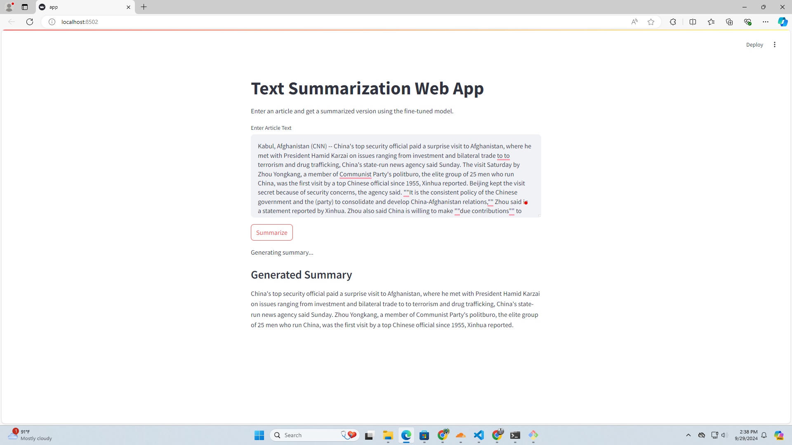

# Automated_Text_Summerization

Here I have made a text summerization bot

### Prerequisites

- Python 3.x
- Jupyter Notebook or any compatible environment
- Visual Studio code

### Installation

1. Clone the repository:

```bash
git clone https://github.com/S18-Niloy/Automated_Text_Summerization.git
```
2. Install dependencies:
```
pip install -r requirements.txt
```
3. Run the model:
```
streamlit run app.py
```

# Interface: 

  

